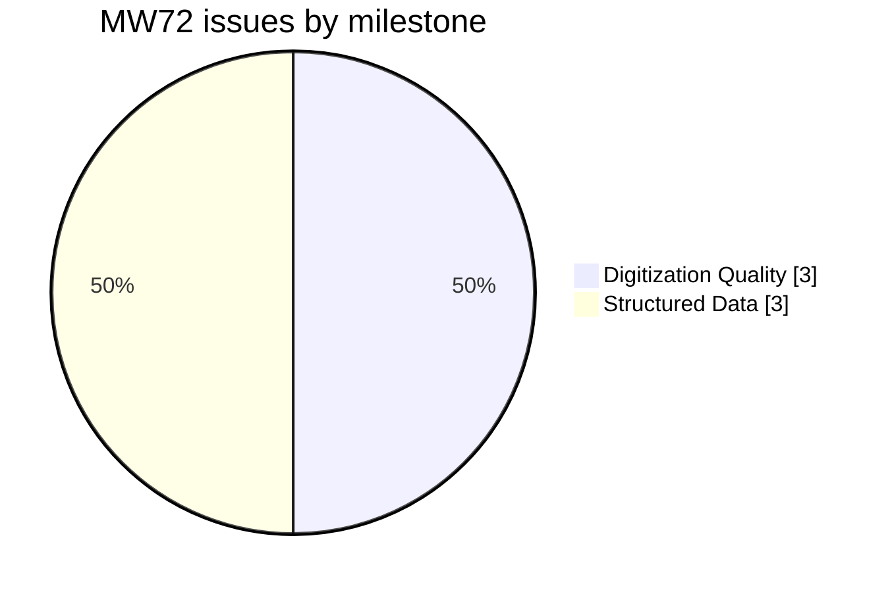
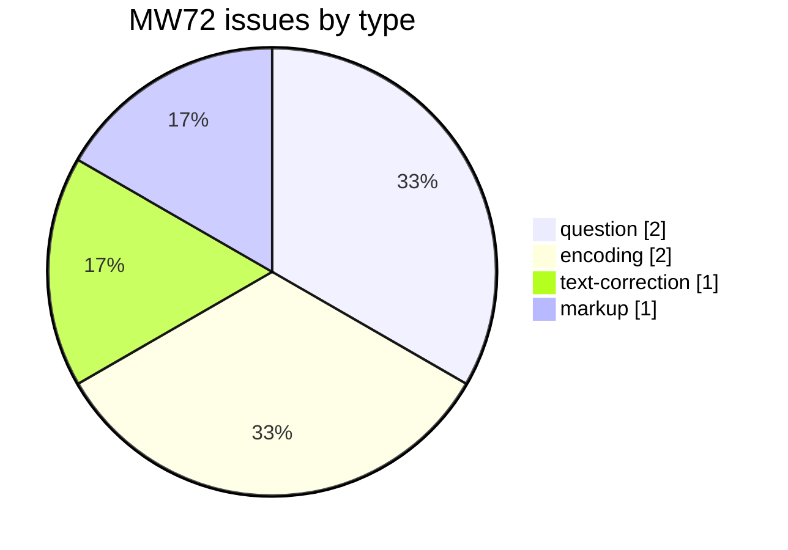
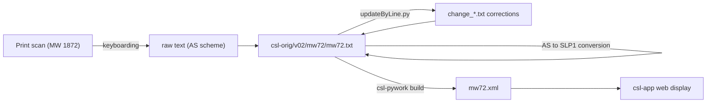

# MW72 — Monier-Williams *A Sanskrit-English Dictionary* (1872)

_Created: 14-08-2014 · Last updated: 02-08-2026_

Development and correction repository for the **1872 first edition** of **Monier Monier-Williams's *A Sanskrit-English Dictionary*** — distinct from the better-known, much-expanded 1899 edition (`MW`). Part of the [Cologne Digital Sanskrit Lexicon](https://www.sanskrit-lexicon.uni-koeln.de/) (CDSL). The canonical source text lives in [`csl-orig/v02/mw72/mw72.txt`](https://github.com/sanskrit-lexicon/csl-orig/blob/master/v02/mw72/mw72.txt) (55,388 entries); this repository holds preparatory and correction work.

**Edition basis (house note, 02-08-2026):** MW72's English-gloss stock rests on **Wilson 1832**, with **PWG matter added** on top. MW 1899 then **brings English meanings forward** from this edition. That is the MW-side Wilson path; PWG itself rests on **Wilson 1819** (not digitised as a full body at Cologne). Do not treat "Wilson" as edition-free when comparing MW72/MW to PWG. Full chain: [WIL edition lineage 1819/1832](https://github.com/sanskrit-lexicon/WIL/blob/main/docs/WIL_EDITION_LINEAGE_1819_1832.md). Note also: this digitisation carries **zero** `<ls>` source tags ([FINDINGS §511](https://github.com/gasyoun/SanskritLexicography/blob/master/FINDINGS.md#511-mw72-carries-zero-ls-source-citations--every-cross-dictionary-citation-test-that-names-it-shrinks-to-mw)).

## Documentation

- [CLAUDE.md](https://github.com/sanskrit-lexicon/MW72/blob/master/CLAUDE.md) — repository guide, correction workflow, and data-format reference.
- [WIL edition lineage](https://github.com/sanskrit-lexicon/WIL/blob/main/docs/WIL_EDITION_LINEAGE_1819_1832.md) — 1819 (PWG) vs 1832 (this edition's English base).

## Contents

| Path | Purpose |
|---|---|
| `20161107/` | Preparatory work (Nov 2016) for proposed mw72 digitization changes (see [issue #3](https://github.com/sanskrit-lexicon/MW72/issues/3)) |
| `prefaces/` | Front-matter OCR (title, Preface, Directions, Abbreviations, letter-order table) + EN/RU — see [Front matter](#front-matter-prefaces) below |
| `CITATION.cff` | Machine-readable citation metadata |

## Timeline

| Period | Activity |
|---|---|
| 2014-08 | Repository initialized |
| 2016-11 | Preparatory work on AS→SLP1 conversion |
| 2026-05 | Issue taxonomy, citation metadata, documentation |
| 2026-06 | Front-matter OCR + EN/RU translation of the 1872 preface (`prefaces/`) |

## Projects & Milestones

| Milestone | Open | Closed | Total |
|---|---|---|---|
| Dictionary to Book | 0 | 0 | 0 |
| Digitization Quality | 0 | 3 | 3 |
| Structured Data | 1 | 2 | 3 |
| Major Enhancements | 0 | 0 | 0 |
| **Total** | **1** | **5** | **6** |

## Issues

### Open

| # | Title | Type | Severity | Milestone |
|---|---|---|---|---|
| 7 | docs-pass: MW72 documentation review | question | minor | Structured Data |

### Solved

| # | Title | Type | Severity | Milestone |
|---|---|---|---|---|
| 1 | IAST convention of MW72 for vocalic 'r' | question | minor | Structured Data |
| 2 | vakratu? | text-correction | minor | Digitization Quality |
| 3 | Converting Sanskrit in MW72 from AS to slp1 | encoding | medium | Digitization Quality |
| 4 | MW72 IAST: use modern forms only | encoding | medium | Digitization Quality |
| 6 | [markup] Minor mw72.txt Markup Oddities | markup | minor | Structured Data |

## Labels

### Type labels
| Label | Meaning |
|---|---|
| `link-target` | Click-throughs from `<ls>` abbreviations to scanned PDF pages |
| `link-splitting` | Splitting combined `SOURCE N,N` refs into per-page links |
| `markup` | Normalising XML tag content |
| `text-correction` | Corrections to English definitions or Sanskrit headwords |
| `content-enhancement` | New material or structural additions beyond correction |
| `encoding` | SLP1/AS/IAST transcoding, character normalisation |
| `scan-quality` | Replacing blurry/skewed/missing scan pages |
| `bug` | Broken links, XML errors, broken downloads |
| `question` | Scholarly questions requiring research |

### Severity labels
| Label | Meaning |
|---|---|
| `minor` | Targeted fix — a handful of lines or a single file |
| `medium` | Standard unit of work — one batch of corrections |
| `hard` | Large effort spanning many sources or files |

## Contributors

| Contributor | Commits |
|---|---|
| funderburkjim | 5 |
| Mārcis Gasūns | 1 |

## Source

- **Author**: Monier-Williams, Monier
- **Title**: *A Sanskrit-English Dictionary* (first edition)
- **Place / Publisher**: Oxford: Clarendon Press
- **Year**: 1872
- **Language pair**: Sanskrit → English
- **Entries (digital edition)**: 55,388
- **Relation**: distinct first edition; the 1899 expanded edition is digitized separately as [`MW`](https://github.com/sanskrit-lexicon/MWS)
- **License (digital edition)**: CC BY-SA 4.0
- See [CITATION.cff](CITATION.cff) for machine-readable citation.

## Encoding

- UTF-8 (NFC) throughout.
- Sanskrit text in SLP1 transliteration, wrapped in `{#…#}`; English gloss / italic display text in ``.
- The original digitization used the AS (Anusvāra) scheme; conversion to SLP1 and modern IAST is tracked in issues [#3](https://github.com/sanskrit-lexicon/MW72/issues/3) and [#4](https://github.com/sanskrit-lexicon/MW72/issues/4).
- Devanāgarī and IAST are generated at display time, not stored in the source.

## How it works

## Front matter (`prefaces/`)

The [`prefaces/`](https://github.com/sanskrit-lexicon/MW72/blob/master/prefaces/README.md) folder holds a faithful OCR of the **front matter** of the printed 1872 first edition — the title page, the seven-section **Preface** (signed *Monier Williams, Oxford, May 1872*), the **Directions** for using the dictionary, the **Abbreviations** table, and the **Nāgarī / Indo-Romanic letter-order** transliteration table — transcribed from the Cologne csldoc scans, with a **Russian** translation of every page.

- **Source language is English**, so there are no `.en.md` files (the base `mw72prefNN.md` is the English); each page also has a `.ru.md` Russian translation.
- Consolidated single-file editions: [`mw72pref_all.en.md`](https://github.com/sanskrit-lexicon/MW72/blob/master/prefaces/mw72pref_all.en.md) and [`mw72pref_all.ru.md`](https://github.com/sanskrit-lexicon/MW72/blob/master/prefaces/mw72pref_all.ru.md), regenerable via [`build_combined.py`](https://github.com/sanskrit-lexicon/MW72/blob/master/prefaces/build_combined.py).
- Full page index, signatures/dates, and conventions: [`prefaces/README.md`](https://github.com/sanskrit-lexicon/MW72/blob/master/prefaces/README.md).
- Cologne source: <https://sanskrit-lexicon.uni-koeln.de/scans/csldev/csldoc/build/dictionaries/prefaces/mw72pref.html>. The digitizer running header/footer stamps were omitted as not part of the original.

25 pages × (English + Russian). The Abbreviations and the two bibliography pages are dense three-column tables (rendered as single alphabetical lists); work-titles and abbreviation keys are kept verbatim, the Nāgarī column is Unicode Devanāgarī.

<strong>OCR run notes (2026-06-23)</strong> — cost, timing, and technical lessons

Produced by the `/cologne-preface-ocr` skill (vision OCR + translation). Process retrospective, not part of the deliverable.

**Cost.** Run synchronously in the main thread (no subagents, per `.preface_retry_rules.md`). Resumed a half-finished job: pages 01–08 were already on disk. This run OCR'd pages 09–25 (≈70 native-resolution crop reads — left/right column bands + dense-footnote and three-column-table re-crops) and wrote all 25 Russian translations. Main-thread estimate ≈ **0.7–0.9 M tokens** (crop reads dominate; the abbreviation and bibliography tables took the most crops).

**Time.** Single synchronous pass; each OCR page kept under the ~2 min budget by capping crops at ≤5 bands and using `[?]` rather than over-zooming.

**Technical lessons (reusable):**
1. The MW72 csldoc scans are **low-resolution** (738 × 984 px), not the 3000–6800 px scans the skill assumes. The whole-page Read is still illegible, so crop per column/band and upscale each crop ≤ ~1900 px (`crop.py` LANCZOS, scale ≤ 2.6×). Native crops, never a 2× whole page.
2. Dense **footnotes** and the **three-column** Abbreviations / bibliography pages need their own higher-zoom crops; the right edge of a column clips into the next, so re-crop the boundary.
3. `build_combined.py` page glob must be `mw72pref[0-9][0-9].md` (matches `mw72prefNN.md`), and must exclude `.ru.md`/`.en.md`. The known `mw72NN` vs `mw72prefNN` mismatch did **not** occur here.
4. The H2 sanity check (1 TOC + 25 pages = 26) caught page 25's **second `# H1`** (the Indo-Romanic letter-order table) — demoted it to `##` in source so the consolidated file stays one H2 per page.
5. Source language is English → produce `.ru` only, skip `.en`; the consolidated `*_all.en.md` is built from the base `.md` files.

---
*Issue taxonomy and documentation per the [Cologne issue runbook](https://github.com/sanskrit-lexicon/csl-observatory/blob/main/runbook/cologne-issue-runbook.md).*
