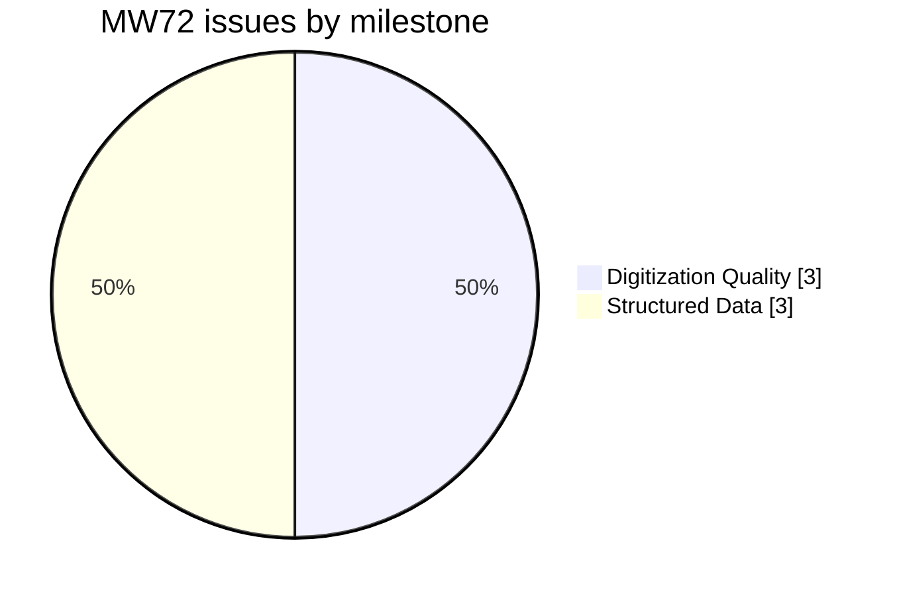
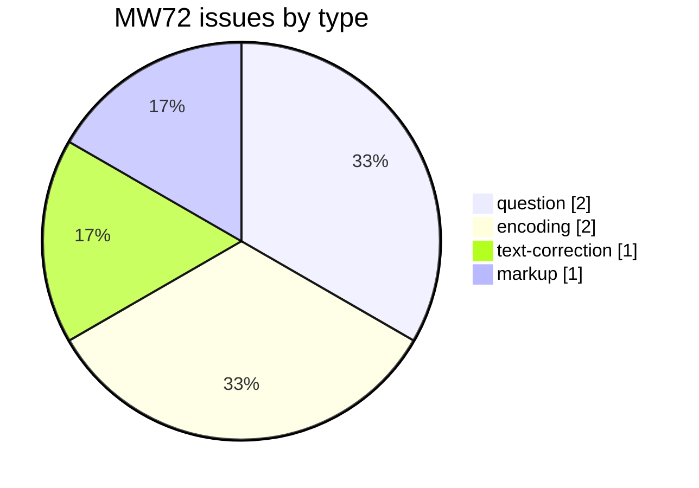
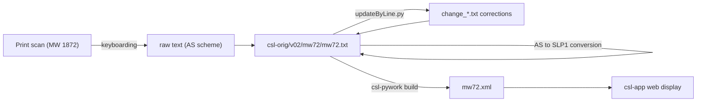

# MW72 — Monier-Williams *A Sanskrit-English Dictionary* (1872)

Development and correction repository for the **1872 first edition** of **Monier Monier-Williams's *A Sanskrit-English Dictionary*** — distinct from the better-known, much-expanded 1899 edition (`MW`). Part of the [Cologne Digital Sanskrit Lexicon](https://www.sanskrit-lexicon.uni-koeln.de/) (CDSL). The canonical source text lives in [`csl-orig/v02/mw72/mw72.txt`](https://github.com/sanskrit-lexicon/csl-orig/blob/master/v02/mw72/mw72.txt) (55,388 entries); this repository holds preparatory and correction work.

## Documentation

- [CLAUDE.md](CLAUDE.md) — repository guide, correction workflow, and data-format reference.

## Contents

| Path | Purpose |
|---|---|
| `20161107/` | Preparatory work (Nov 2016) for proposed mw72 digitization changes (see [issue #3](https://github.com/sanskrit-lexicon/MW72/issues/3)) |
| `CITATION.cff` | Machine-readable citation metadata |

## Timeline

| Period | Activity |
|---|---|
| 2014-08 | Repository initialized |
| 2016-11 | Preparatory work on AS→SLP1 conversion |
| 2026-05 | Issue taxonomy, citation metadata, documentation |

## Projects & Milestones

| Milestone | Open | Closed | Total |
|---|---|---|---|
| Dictionary to Book | 0 | 0 | 0 |
| Digitization Quality | 0 | 3 | 3 |
| Structured Data | 1 | 2 | 3 |
| Major Enhancements | 0 | 0 | 0 |
| **Total** | **1** | **5** | **6** |

## Issues

### Open

| # | Title | Type | Severity | Milestone |
|---|---|---|---|---|
| 7 | docs-pass: MW72 documentation review | question | minor | Structured Data |

### Solved

| # | Title | Type | Severity | Milestone |
|---|---|---|---|---|
| 1 | IAST convention of MW72 for vocalic 'r' | question | minor | Structured Data |
| 2 | vakratu? | text-correction | minor | Digitization Quality |
| 3 | Converting Sanskrit in MW72 from AS to slp1 | encoding | medium | Digitization Quality |
| 4 | MW72 IAST: use modern forms only | encoding | medium | Digitization Quality |
| 6 | [markup] Minor mw72.txt Markup Oddities | markup | minor | Structured Data |

## Labels

### Type labels
| Label | Meaning |
|---|---|
| `link-target` | Click-throughs from `<ls>` abbreviations to scanned PDF pages |
| `link-splitting` | Splitting combined `SOURCE N,N` refs into per-page links |
| `markup` | Normalising XML tag content |
| `text-correction` | Corrections to English definitions or Sanskrit headwords |
| `content-enhancement` | New material or structural additions beyond correction |
| `encoding` | SLP1/AS/IAST transcoding, character normalisation |
| `scan-quality` | Replacing blurry/skewed/missing scan pages |
| `bug` | Broken links, XML errors, broken downloads |
| `question` | Scholarly questions requiring research |

### Severity labels
| Label | Meaning |
|---|---|
| `minor` | Targeted fix — a handful of lines or a single file |
| `medium` | Standard unit of work — one batch of corrections |
| `hard` | Large effort spanning many sources or files |

## Contributors

| Contributor | Commits |
|---|---|
| funderburkjim | 5 |
| Mārcis Gasūns | 1 |

## Source

- **Author**: Monier-Williams, Monier
- **Title**: *A Sanskrit-English Dictionary* (first edition)
- **Place / Publisher**: Oxford: Clarendon Press
- **Year**: 1872
- **Language pair**: Sanskrit → English
- **Entries (digital edition)**: 55,388
- **Relation**: distinct first edition; the 1899 expanded edition is digitized separately as [`MW`](https://github.com/sanskrit-lexicon/MWS)
- **License (digital edition)**: CC BY-SA 4.0
- See [CITATION.cff](CITATION.cff) for machine-readable citation.

## Encoding

- UTF-8 (NFC) throughout.
- Sanskrit text in SLP1 transliteration, wrapped in `{#…#}`; English gloss / italic display text in ``.
- The original digitization used the AS (Anusvāra) scheme; conversion to SLP1 and modern IAST is tracked in issues [#3](https://github.com/sanskrit-lexicon/MW72/issues/3) and [#4](https://github.com/sanskrit-lexicon/MW72/issues/4).
- Devanāgarī and IAST are generated at display time, not stored in the source.

## How it works

---
*Issue taxonomy and documentation per the [Cologne issue runbook](https://github.com/sanskrit-lexicon/csl-observatory/blob/main/runbook/cologne-issue-runbook.md).*
